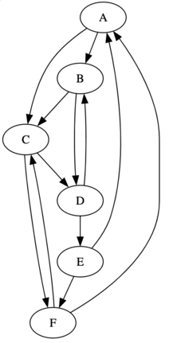
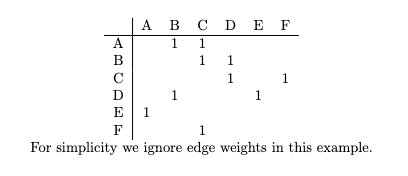

# graphblas-risk-analysis

A Python systemic risk analysis tool leveraging GraphBLAS's optimized sparse matrix operations for large scale risk propagation simulation. Uses  DebtRank methodology to quantify systemic risk within a financial system. For those interested in the mathematical and conceptual details behind this implementation, please refer to the [Methodology Guide](methodology_guide.md).

## Basic Usage

An example usage is located within `src/analysis.py`. The core logic behind the distress propagation can be seen in `src/debt_rank`.

## Systemic Risk And DebtRank

In the context of financial networks, systemic risk refers to the potential for localized risks or shocks to have large-scale, system-wide effects. In the context of this application we quantify systemic risk that can be posed by an institution or set of institutions using the DebtRank methodology.

DebtRank is a percentage representing the proportion of the total economic value of the network that is affected by the distress of a particular institution or set of institutions. For example, if an instution with a DebtRank of 0.2 were to fail, it suggests that up to 20% of the total economic value of the network could potentially be lost due to the cascading effects of that failure. This loss could occur through a combination of other nodes also failing, or their economic value being reduced.

## Getting a Sense of the Network: The Asset Liability Matrix

Many financial regulators possess aggregate data on interbank exposures, but the intricate web of individual bilateral exposures within the network often remains hidden. This project seeks to demonstrate that such concealed information can be invaluable in analyzing systemic risk within the network. Moreover, the application of sparse matrix computations can be a potent tool in simulating distress propagation, especially considering that these networks are typically sparse.

Consider a fictious financial network:

This graph illustrates the financial network consisting of nodes or institutions, labeled $A - F$. The edges connecting these institutions represent contracts, which are agreements on future cash flows such as credit, options, loans, etc. Though in the current implementation we are only considering loans between parties.

We can represent the graph as an adjacency matrix:

In more general terms we represent our financial network as an Asset Liability Matrix, $L$, where each element $L_{ij}$ represents a loan from $j$ to $i$. And the weights of the edges tell us how much money has been loaned.

Thus row sums and columns sums at index $i$ of the matrix would correspond with the amount of money institution $i$ owes and *is owed* respectively.

The purpose of this matrix $L$ is to capture the network of financial exposures that can lead to the propagation of distress through the system. This is the starting point for our simulation.

## Why GraphBLAS

While financial networks are traditionally viewed as graphs, a linear algebra approach offers significant benefits for representing the calculation of DebtRank.

The GraphBLAS standard is a specification for graph algorithms using linear algebra operations, with a focus on sparse matrices. It includes standard matrix operations and supports custom semirings, allowing for tailored addition and multiplication functions. This combination enables the efficient expression and implementation of complex graph algorithms in a mathematical framework.  

Unlike general sparse computation libraries, GraphBLAS is finely tuned to handle sparse matrices within graph structures, making it a highly efficient choice for financial networks. Its parallel processing capabilities enhance computational speed, while its inherent scalability ensures adaptability across various network sizes. GraphBLAS's semirings allows for the precise definition of propagation rules for distress in DebtRank, offering a tailored DebtRank analysis that goes beyond what general sparse computation libraries can provide.

## Construction of Synthetic Dataset

I'm currently using a script to generate our Asset Liability Matrix and other relevant information for the simulation. The script can be found in `data_utils/generate_data.py`. A quick overview of the file:

* Generates a synthetic financial network with n nodes (institutions).
* Capital for each node is generated following a power-law distribution.
* Connections and exposures between nodes are determined based on their capital, connection_factor, and exposure_factor.
* Returns the capital of each node and the edges representing exposures between nodes.

The synthetic financial network generation script provides a simplified model of real-world financial systems. By determining connections proportionally to capital and defining exposures based on a linear relationship between connected nodes, the script captures essential dynamics observed in complex financial networks (Vitali et al, 2011).

Central nodes with higher capital naturally emerge with more connections and influence, reflecting the core-periphery structure commonly found in financial systems. While the script does not explicitly form communities or model intricate control relationships, the proportional relationship between capital, connections, and exposures indirectly leads to clusters of nodes with similar characteristics and control dynamics.

## Testing With Historical Data

I have been putting in some work to find some publicaly available historical data regarding counterparty exposure between institutions within a financial network. However, most of these datasets are not available to the public, and thus cannot be used in this project.

The development process includes generating synthetic financial data to validate the algorithm, conducting unit testing to ensure functionality, performing sensitivity analysis to assess responses to input variations, and benchmarking against a traditional Python implementation to compare behavior with GraphBLAS optimization.

This aims to build some confidence in the graphBLAS-optimized DebtRank implementation, given the lack of public historical infromation available.

## Future Changes

There is some future work aimed at finding a more empirical application of the DebtRank methodology. One important thing we assume in this implmentation is that the actual value of credit exposure between two instutitons is a known value. This is usually not the case. A more practical way of evaluating our exposures would be to utilize available investment data in the equity of institutions, normalizing these values, and applying an impact scaling factor $\alpha \leq 1$ (Battiston et al, 2012).

This method seeks to construct a proxy for credit exposures, providing a more practical and realistic application of DebtRank in the absence of actual credit exposure values. This is something I plan to look more at in the future.

Additionally, I have put some thought into integrating other credit options within the algorithm. While this could provide a more comprehensive and realistic model of the financial network to base the asset liability matrix off of, it also presents challenges. Adding other credit options might increase the complexity of the model, and potentially dilute the focus on loans, making the analysis less clear-cut. Thus for right now I am cautious about making these changes.

As the project evolves, a main priority will be the integration of plotting and visualization features. Some ideas I have involve visualizing DebtRank distribution, as well as trends over time.

## References

[Battiston, S., Puliga, M., Kaushik, R. et al. DebtRank: Too Central to Fail? Financial Networks, the FED and Systemic Risk. Sci Rep 2, 541 (2012).](https://doi.org/10.1038/srep00541)

[Vitali S, Glattfelder JB, Battiston S (2011) The Network of Global Corporate Control. PLoS ONE 6(10): e25995.](https://doi.org/10.1371/journal.pone.0025995)

[Thurner, S., Poledna, S. DebtRank-transparency: Controlling systemic risk in financial networks. Sci Rep 3, 1888 (2013).](https://doi.org/10.1038/srep01888)

[Yang, C., Buluç, A., & Owens, J. D. (2022). GraphBLAST: A high-performance linear algebra graph-based framework on the GPU. ACM Transactions on Mathematical Software, 48(1), Article 1.](https://doi.org/10.1145/3466795)
